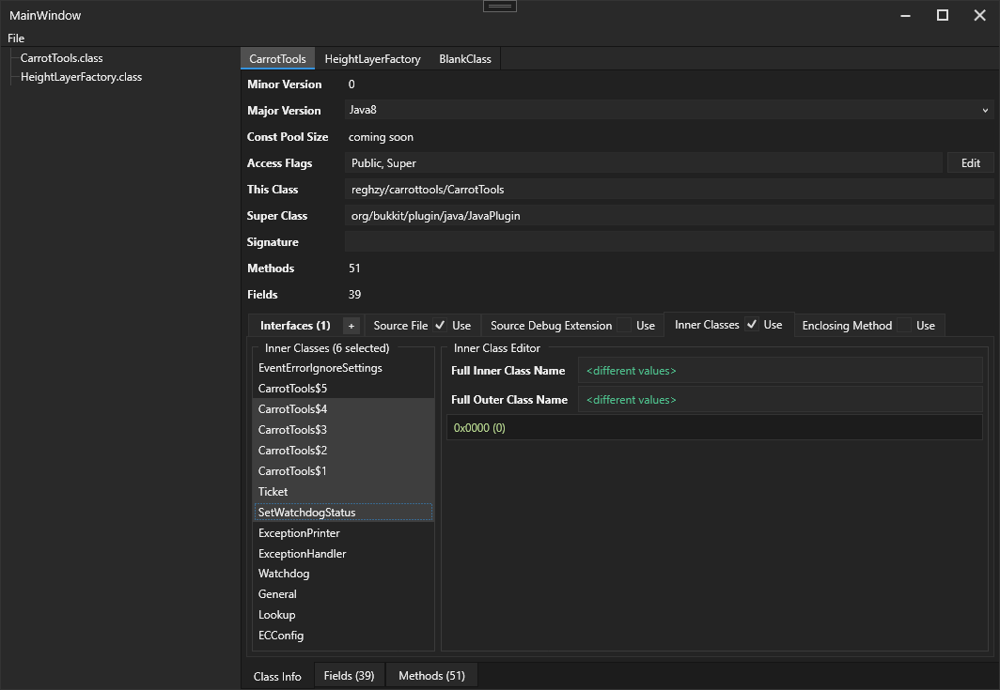
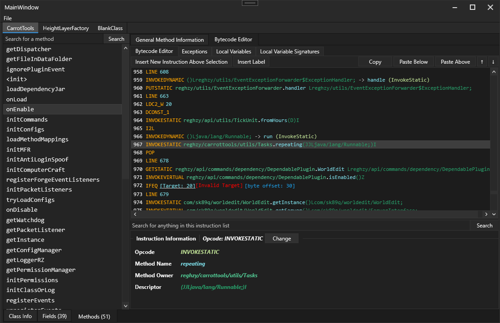

# JBCEditor180

This is a remake of BCEdit180, which I made a while ago, but I tried to refactor the code and kinda gave up after seeing 1000s of errors. This project I wanted to implement some new features and generally improve the old code base (e.g. support multiple selection editing, which works for method and field attributes at the moment)

I also hope to implement a text-based bytecode editor, and have a 'compiler' to turn the bytecode text into actual byte code because at the moment, the only editor is a list box based editor which is a slight hassle as there's no drag-dropping

# Features 
- Class info viewer
- Interfaces list (can edit, add and remove interfaces)
- Visible/Invisible field and method attributes (cannot save at the moment)
- Method list and info editor (descriptor, name, max stack/locals, etc)
- Method instruction editor (bytecode editor), allowing basically every single instruction to be modified. The bytecode editor also has colours, which helps the details stand out.
- Exception table and local variable table editor. Cannot add/remove exceptions or local variables currently (coming soon)
- Field list and info editor (name, descriptor, signature, etc)
- Methods can be removed in the UI, but I haven't implemented saving yet, so removed methods don't actually get removed

# Previews

### Class Info Viewer

### Bytecode Editor

# Building
Visual Studios/Rider should auto download the nessesary packages, and you should be able to built it as long as you have .NET Framework 4.7.2 installed
